# 👨‍💻 Álvaro Fabián Baldiviezo Rodríguez

**Systems Engineering Student | Backend & Software Architecture Engineer | IoT Enthusiast**

  

---

## 🚀 About Me

Soy estudiante de **Ingeniería de Sistemas** en la **Universidad Católica Boliviana San Pablo** 🇧🇴, apasionado por diseñar sistemas backend escalables, mantenibles y de alto impacto.  

Me especializo en **arquitectura de software y desarrollo backend**, creando soluciones que no solo funcionan, sino que están preparadas para crecer. También me encanta combinar software con **IoT** para resolver problemas del mundo real.  

Con certificación de inglés **B2 (Upper Intermediate)** por el Centro Boliviano Americano y EDUSOFT, me desenvuelvo con confianza en entornos internacionales y documentación técnica.

---

## 🧠 Technical Focus

- Software Architecture & System Design  
- Backend Development & API Design (REST + GraphQL)  
- Scalable Systems & Database Modeling  
- Authentication & Authorization (OAuth2, Google Sign-In)  
- IoT Solutions & Real-time Systems
- DevOps

---

## 🛠️ Tech Stack

### 💻 Languages

### ⚙️ Frameworks & Tools

### 🗄️ Databases

---

## 📊 GitHub Stats

  
  

---

## 📚 Education

- 🎓 **Ingeniería de Sistemas** — Universidad Católica Boliviana San Pablo  
- 🏫 Bachiller — Colegio San Bernardo de Tarija

---

## 🌐 Languages

- 🇪🇸 Español — Nativo  
- 🇬🇧 Inglés — **B2 Upper Intermediate** (Centro Boliviano Americano + EDUSOFT Level 6 P2)

---

## 🏆 Featured Projects

### 🅿️ Smart Parking IoT
Sistema IoT de estacionamiento inteligente con monitoreo en tiempo real.

- Diseño completo de arquitectura del sistema  
- Modelado de datos con sensores y procesamiento en tiempo real  
- Optimización de eficiencia y escalabilidad  

**Tecnologías:** Go / Node.js + TypeScript, Docker, Firebase, sensores IoT  
**[→ Ver repositorio](https://github.com/AlvaroThg/smart-parking-iot)** 

### 🔐 License Management System
Sistema web completo con autenticación y automatización de procesos.

- Integración de Google Sign-In y OAuth2  
- Automatización de correos y flujos de aprobación  
- Validación de datos y control de workflows  

**Tecnologías:** Next.js, TypeScript, MySQL, Firebase  
**[→ Ver repositorio](https://github.com/AlvaroThg/license-management)** 

---

## 🎯 Professional Goals

- Convertirme en **Software Engineer** especializado en Arquitectura de Sistemas  
- Diseñar soluciones backend de alto rendimiento y escalables  
- Desarrollar proyectos que combinen software + IoT con impacto real  

---

## 🧩 Core Values

- Mindset de resolución de problemas  
- Código limpio y escalable  
- Aprendizaje continuo  
- Tecnología con propósito  

---

## ⚡ Personal Interests

- 🎸 Guitarra y música  
- 🎮 Gaming  
- 🍳 Cocina  
- 🍫 Chocolate enthusiast  

---

## 📫 Let's Connect!

**Abierto a colaboraciones, oportunidades de aprendizaje y proyectos interesantes.**

- [LinkedIn](www.linkedin.com/in/alvarofabianbaldiviezorodriguez) 
- [Email](mailto:alvarobaldiviezo8@gmail.com)  

---

*Last updated: Abril 2026*
